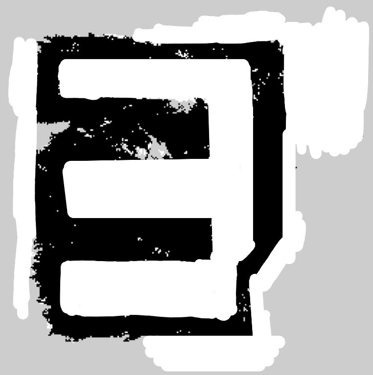
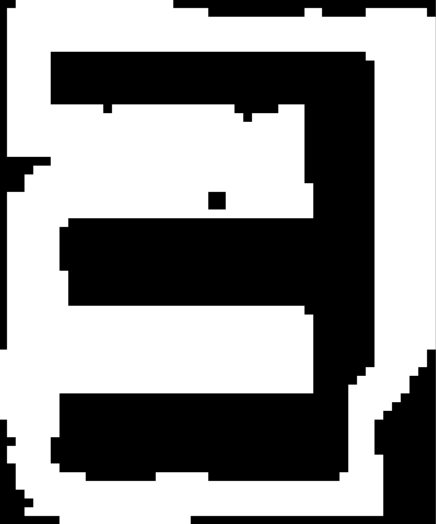

PathPlaning Algorithm for Dpoom
===

## Modified A* algorithm with Distance cost
For planning path for indoor robots, the original A* algorithm has a problem; __Genelating the path too close to obstacles.__ 
Therefore, in this modification, __"Distance Cost"__ is added to cost calculation of A* algorithm.  

_f = g + h + __d___ 

The distance cost is given to the certain node according to the distance of the node and nearing obstacles.
High distance cost means that the current node is nearing the obstacles.
Therefore, because the original A* algorithm select nodes with minimum cost, the generated path have tendency to be far away from the obstacles.  
(For deriving distance cost, Fast marching methond was used.)

Below chart shows the difference by applying distance cost to actual pathplanning. 

| Without distance cost | With distance cost |
|---|---|
|||

You can try this pathplanning in 'lobby_obtimization_sample.py.

## Dependency
```bash
import matplotlib.pyplot as plt
import cv2
import numpy as np
import imutils
import random
import pyfmm #if you want to use fast marching method to derive distance cost
import time #if you want to see calculation speed of the algorithm
```

## How to generate pathplanning
```bash
def pathplanning(start, end, image_path, verbose=0):
  return convert2meter(path) 
  # Return the metered path, which is converted from  grid scale to grid scale
```
To generate the path, offer these informations; start grid position, end grid position, and path of the map image file. 
This function return the list of meter-scaled path positions.

## Main functions
### 1. img2binList
```bash
def img2binList(img, lenWidth, GRID_SIZE=50, verbose=0):
  global DISTANCECOSTMAP
  return maze
```
Convert RGB image to binary list. In this function, the image file is cropped first, and then converted to binary list. Additionally, global variable __DISTANCECOSTMAP__ is created containing the information about the distance from every grid to nearing obstacles. This variable is calculated by _march_ function of fast marching method(fmm).  
Parameters: __lenWidth__ is the actual width of the map in _cm_ scale, and __GRID_SIZE__ is the actual size of the grid in _cm_ scale.

| Original Image (SLAM) | Cropped Image | Binary List | DISTANCECOSTMAP |
|---|---|---|---|
|||||

### 2. distcost
```bash
def distcost(x, y, safty_value=2):
  return distance_cost 
  # You can manually tune the weight of the distance cost by multiplying to the returning value.
```
It calculate the distance cost of the specific grid(x, y) using global variable __DISTANCECOSTMAP__.
The node which is closer from the obstacles has the higher distance cost value.
In this function, you can make several nodes around the obstacle as 'almostly not allowed nodes' by activate following three lines:
```bash
    #if distance_cost > (max_distance_cost/safty_value):
    #    distance_cost = 1000
    #    return distance_cost
```
Large safty value make more 'almostly not allowed nodes' nearing the obstacles. However, if it is too large, almost every grid will have maximum distance cost(=1000) which leads to eliminate the meaning of distance cost. Therfore, this value should be manually tuned.


### 3. astar
```bash
def astar(maze, start, end):
  return path[::-1] # Return reversed path
```
It generate the path list in grid scale. The input _maze_ is type of binary list which is the returning form of __img2binList__ function. Return value should be reversed because A* algorithm collect the elements of the path from the end node to start node.

<center></center>

