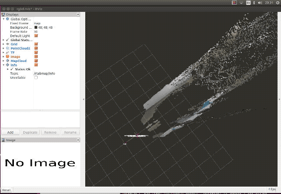
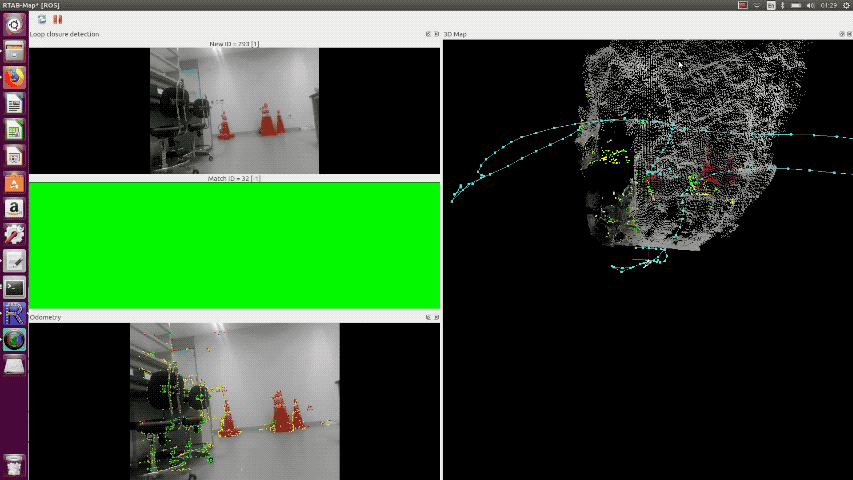

# Installation

## ROS
http://wiki.ros.org/kinetic/Installation/Ubuntu

## Realsense
https://github.com/IntelRealSense/realsense-ros
https://github.com/IntelRealSense/librealsense/blob/master/doc/installation.md

## Realsense-ros packages include rtabmap
https://github.com/IntelRealSense/realsense-ros/wiki/SLAM-with-D435i


# Make custom rosbag file
__I strongly do not recommend to record a custom rosbag file to test rtabmap !!!!!!!!__ It may be more efficient way to make a map file (pcd file). However, rtabmap gives you a chance to restore odometry when it fails tracking, by relocating the camera to the last tracked position. __So I recommend to make a map by online method, not by using rosbag file!!__

You can see the specific instructions of recording rosbag file with 'D435i' and launching rtabmap with your custom rosbag. 
[rtabmap_using_custom_rosbag.md](rtabmap_using_custom_rosbag.md)


# SLAM with D435i
## Mapping with rtabmap
After install all the prerequisition, you can launch rtabmap by running scripts in terminal:
```bash
$ roslaunch realsense2_camera opensource_tracking_tk_online.launch
```
You should download my launch file [launch/opensource_tracking_tk_online.launch](launch/opensource_tracking_tk_online.launch), and locate it in '/catkin_ws/src/realsense-ros/realsense2_camera/launch' directory. rtabmap will be launched and you can perform mapping by dragging D435i with your labtop. 




I recommend to use 'rtabmapviz', as in my launch file. If you want to use 'rviz' to visualize, just change two parameters in the launch file.
```bash
<arg name="rtabmapviz" value="false"/>
<arg name="rviz" value="true"/>
```

## Loop Closure
rtabmap will perform loop closure automatically. 


## Save Map Data
You can save your map data in pcd file while rtabmap is still running.
```bash
$ rosrun pcl_ros pointcloud_to_pcd input:=/rtabmap/cloud_map
```
Also, you can save your map as 2D image.
```bash
rosrun map_server map_saver -f my_map_1 map:=/rtabmap/proj_map
```
You can visualize your pcd file using 'pcd_viewer'.
```bash
pcl_viewer (your_pcd_file.pcd)

```

## Localization with rtabmap
After complete mapping in your environment, ctrl+c to stop mapping. The pointcloud data will be automatically saved at 'home/user/.ros/rtabmap.db'. You can now perform pure localization by changing some parameters in launch file. It will load the map saved at last time, and perform matching and give you the relative position from your map. You can simply run my launch file.
```bash
$ rosrun realsense2_camera opensource_tracking_tk_localization.launch
```
The source is here [launch/opensource_tracking_tk_localizationl.launch](launch/opensource_tracking_tk_localizationl.launch) and you should put it to the ros package too.



# Post-processing Position Data from Matching
## odom_listener
The odometry data is published as name of '/rtabmap/odom' while rtabmap localization is running. It contains data as below:


__Since our path planning and driving modules (easySeries) requires (x,y) position of the robot, [odom_listener.py](odom_listener.py) is made for subscribing '/rtabmap/odom' and parsing it to position data.__ And I plot its trajactory using matplotlib.

<p>
  
  
</p>

The left image is the result of traveling in my office while running pure localization of rtabmap. The right image is the 2D projection of created map. You can see that odometry provides really accurate position data. The position data describes relative location from the origin, and the unit is meter. As result of comparision, error of the data is just few centimeters. 

# Field Test
| Initializing First Pose | Localization While Robot Driving |
|---|---|
|||

When the SLAM first launched, it initializes robot's first pose by matching the features on the pre-created SLAM map. You can see the results on the left. The live demo on the right is recorded on the DPoom. DPoom was controlled by keyboard input using [easyControl](/easygo/easyControl.py). The live demo shows that SLAM could perform real-time localization while the robot is actually driving. And the pose is published to the ROS.
